# System Architecture: AI-Powered Discovery Engine for Google Photos Retrieval

This document describes the technical architecture for the research discovery engine defined in [`context.md`](./context.md). The system ingests public conversations, identifies evidence about **vague visual-memory retrieval** in Google Photos, extracts structured experiences, discovers patterns, and presents traceable findings to researchers.

---

## 1. Architecture goals

| Goal | Architectural response |
|------|-------------------------|
| Evidence-first discovery | Immutable raw store; all insights reference record IDs |
| Multi-source ingestion | Pluggable source adapters behind a common contract |
| Cost-efficient LLM use | Deterministic pre-filter → batched classification → extraction only on positives |
| Resumable pipelines | Job queue with checkpoints, idempotent writes, versioned model outputs |
| Researcher traceability | UI and exports preserve lineage: cluster → structured fields → raw text → source URL |
| No premature taxonomy | Clustering is a separate stage; archetypes emerge from data + optional LLM synthesis |
| Source-agnostic intelligence | Relevance + UX extraction read **only** `canonical_record`; ingest adapters are the sole per-source code path ([`implementation-plan.md`](./implementation-plan.md) Phases 2–3) |
| Calibrate on Reddit, generalize to all sources | Gold set and volume targets tune prompts; **no** `source_type` branches in labeling logic; Phase 7 re-runs same stages |

---

## 2. High-level system context

External actors and systems interact with the discovery engine as a **batch-analytics + research portal**, not as a consumer Google Photos integration.

**Primary actor:** **Researcher / Operator** — uploads datasets, configures API credentials, triggers analysis runs, monitors processing, inspects results, and explores findings in the research interface (single role for this MVP).

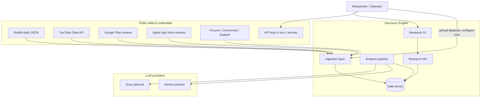

---

## 3. Logical architecture (layers)

The system is organized into five layers. Each layer has a narrow responsibility; cross-cutting concerns (logging, config, secrets) apply to all.

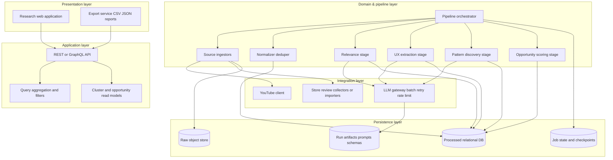

### Layer responsibilities

| Layer | Responsibility |
|--------|----------------|
| **Presentation** | Dashboards, record explorer, cluster views, opportunity comparison, export downloads |
| **Application** | Auth (if needed), pagination, filtering, read-optimized DTOs, export bundling |
| **Domain & pipeline** | Source-agnostic relevance + experiential extraction; clustering metrics and opportunity scoring (taxonomy only after clustering) |
| **Integration** | External APIs, LLM abstraction (Gemini/Groq), retries, token budgeting |
| **Persistence** | Raw vs processed separation, job checkpoints, immutable run metadata |

---

## 4. End-to-end data flow

The discovery pipeline mirrors the workflow in `context.md`. Stages are **sequential with optional re-runs** per stage when prompts or models change.

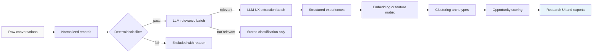

### Stage I/O summary

| Stage | Input | Output | LLM? |
|--------|--------|--------|------|
| Ingest | Source files / APIs | `raw_records` blobs + metadata | No |
| Preprocess | `raw_records` | `canonical_records` | No |
| Deterministic filter | `canonical_records` | candidate subset + `filter_reason` | No |
| Relevance | candidates (`canonical_record`) | `relevance_label`, confidence, rationale, `retrieval_signal_types[]` (theme labels, not archetypes) | Yes (batched); **one prompt all sources** |
| UX extraction | relevant records (any `source_type`) | experiential JSON per schema; **no** cluster/taxonomy fields | Yes (batched); **one prompt all sources** |
| Pattern discovery | structured set | `cluster_id`, labels, exemplars | Optional LLM for naming |
| Opportunity analysis | clusters + records | scores, rankings, evidence links | Optional LLM for narrative |
| Serve | all tables | API responses, exports | No |

**Volume target:** on the **first (Reddit) corpus**, calibration should yield **≥150–200** records marked relevant before clustering, without sacrificing the balanced, **source-agnostic** relevance criterion in `context.md`. Additional sources (Phase 7) use the **same** relevance stage; volume targets are reported per corpus, not baked into code.

---

## 5. Detailed component architecture

### 5.1 Ingestion subsystem

Each source implements a shared **`SourceIngestor`** contract:

- `discover()` — list or fetch available items (API pagination, file glob).
- `fetch(record_ref)` — retrieve one raw payload.
- `map_to_raw()` — produce source-native JSON stored verbatim in raw store.

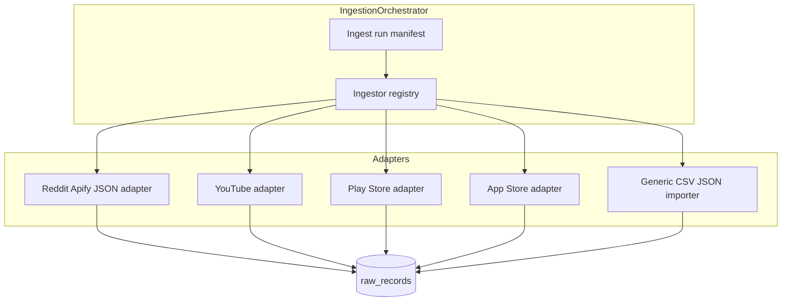

**Design notes**

- Reddit: single bulk import from stakeholder file; checksum stored on manifest.
- YouTube: search + video metadata + top comments; respect quota; cache responses in raw store.
- App stores: prefer official/public APIs or stakeholder imports; treat scrapers as replaceable adapters.
- Every ingest run gets `ingest_run_id`, timestamp, source version, and record counts.

### 5.2 Preprocessing subsystem

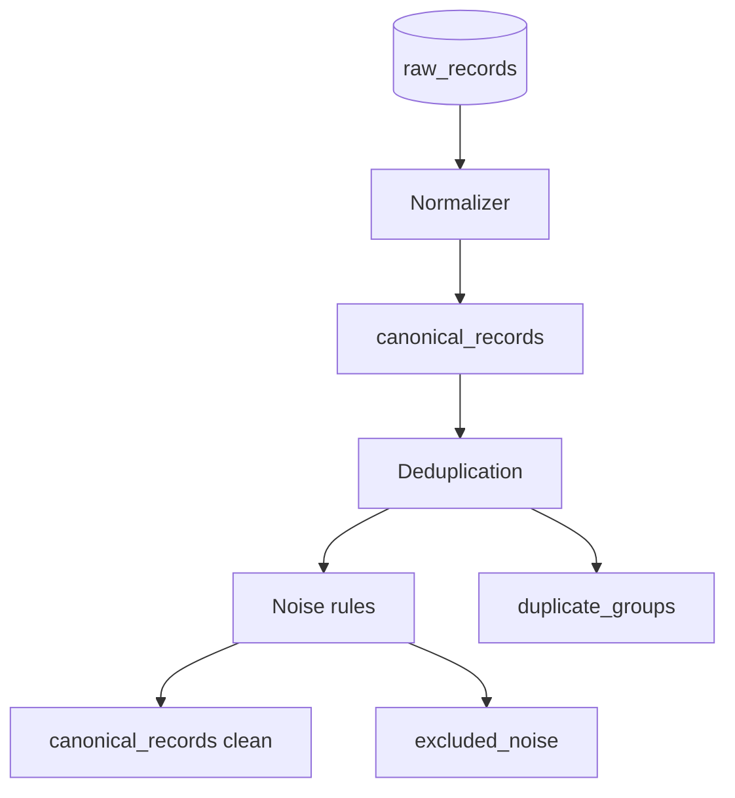

**Normalizer** maps to a **canonical record** (see §6). Rules are source-specific; structure is shared.

**Deduplication** uses a composite key where possible: `(source, content_hash)` and fuzzy match on near-duplicate text for cross-posts.

**Noise removal** is conservative: drop empty bodies, bot-like spam, non-user-generated boilerplate—log exclusions for audit.

### 5.3 Relevance subsystem (hybrid, source-agnostic)

**Inputs:** `canonical_record` fields only (`title`, `body`, optional `source_type` / `permalink` in prompt context). **No** relevance logic in ingestors beyond normalization (§5.1–5.2).

**Criteria:** Documented in [`docs/relevance-criteria.md`](./docs/relevance-criteria.md)—aligned to `context.md` north star and discovery themes, **not** Reddit patterns, subreddit lists, or predetermined problem archetypes.

Two phases minimize LLM cost:

1. **Deterministic gate** — lightweight pass on canonical text: Google Photos / visual-library **retrieval intent**; exclude obvious off-topic items (billing, unrelated apps, generic praise with no retrieval story). Must not rely on platform-specific mandatory keywords as the sole signal.
2. **LLM batch classifier** — single prompt version per `analysis_run_id` for all `source_type` values. JSON schema: `is_relevant`, `confidence`, `rationale`, `retrieval_signal_types[]` (open **theme** tags, not cluster/MVP enums).

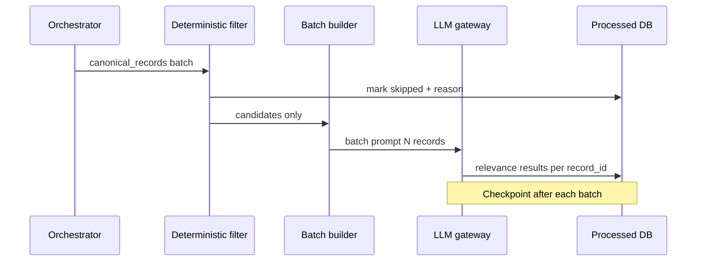

**Calibration:** ~30 stratified manual labels (initially from Reddit) tune gate + prompt against the criteria doc. Reddit provides the first gold set and precision/recall checks; **portability requirement:** Phase 7 sources run this subsystem **unchanged** (incremental record IDs only).

**Anti-patterns:** `if source_type == "reddit"` labeling branches; Reddit few-shot examples that override generic criteria; enums named like future cluster labels.

### 5.4 UX extraction subsystem

Runs **only** on `is_relevant = true` from §5.3, **any source**. **One** extraction prompt per analysis run (no per-platform fork). One LLM call can cover multiple records in a batch if token limits allow; otherwise single-record batches for long threads.

**Non-goals (Phase 3):** `problem_archetype`, `cluster_id`, `opportunity_rank`, or fixed problem-type enums—clustering is §5.5.

Extracted fields (nullable when not stated in source):

- `retrieval_scenario`
- `remembers`
- `forgotten`
- `search_attempt`
- `failure_point`
- `workaround`
- `outcome`

Each field includes optional `evidence_spans` (character offsets or quoted snippets) to support UI highlighting and audit.

### 5.5 Pattern discovery subsystem

**Non-goals:** fixed taxonomy before seeing data.

**Approach (recommended hybrid):**

1. Build text features from structured + original content (e.g. embeddings of concatenated fields).
2. Cluster with algorithm suited to scale (HDBSCAN / k-means with elbow, or hierarchical for smaller N).
3. Optionally use LLM **per cluster** to generate a neutral archetype label and summary from exemplar records only.

Outputs:

- `clusters` — id, label, summary, size, source_distribution
- `cluster_members` — record_id, membership_score
- `exemplars` — top-k records closest to centroid/medoid

### 5.6 Opportunity analysis subsystem

Scores each cluster (and optionally sub-patterns) using **evidence-backed metrics**:

| Metric | Definition (example) |
|--------|----------------------|
| Frequency | Count of supporting records |
| Severity | Rubric from failure_point language + outcome (LLM or rule-assisted) |
| Cross-source consistency | Entropy of source types; bonus if ≥2 sources |
| Evidence strength | % fields with direct quotes; avg confidence |

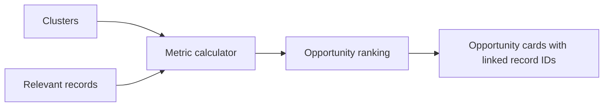

---

## 6. Data model (conceptual)

Raw and processed data are **physically separated**. LLM outputs are versioned by `analysis_run_id` and `model_id`.

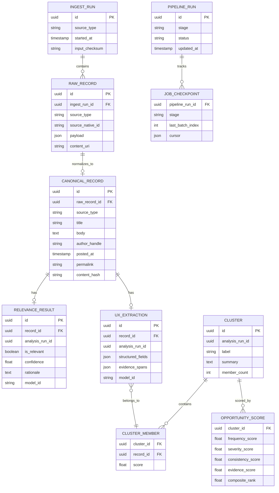

### Canonical record (minimum fields)

| Field | Purpose |
|--------|---------|
| `id` | Stable internal UUID |
| `source_type` | `reddit`, `youtube`, `play_store`, `app_store`, `other` |
| `permalink` | Link back to public evidence |
| `body` | Primary text for NLP/LLM |
| `metadata` | Scores, likes, video id, star rating, etc. |

---

## 7. LLM gateway architecture

Single integration point for Gemini (primary) and Groq (fallback).

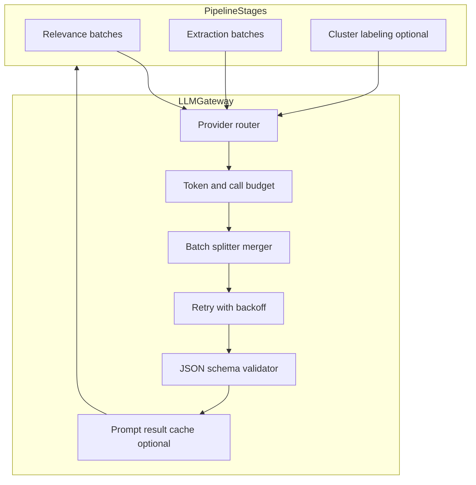

**Policies**

- **Batch size:** dynamic based on token estimate (title + body truncated with explicit `...[truncated]` marker in prompt).
- **Idempotency:** hash `(stage, model_id, prompt_version, record_id)`; skip if result exists unless `force_reanalyze`.
- **Validation:** invalid JSON → single retry with repair prompt; then mark record `analysis_failed` with error text.
- **Provenance:** store full prompt template version, not necessarily full prompt text, unless audit mode enabled.

---

## 8. Pipeline orchestration & resumability

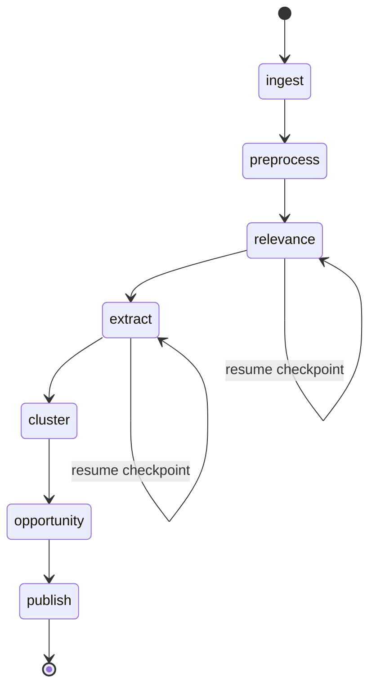

| Mechanism | Behavior |
|-----------|----------|
| `PIPELINE_RUN` | One row per full or partial run |
| Checkpoints | After each LLM batch commit |
| Idempotent writes | Upsert on `(record_id, analysis_run_id, stage)` |
| Re-run | New `analysis_run_id` preserves history for comparison |
| Publish | Materialized views or `published_snapshot` for UI consistency |

CLI entry points (suggested):

- `discover ingest --source reddit --file ...`
- `discover run --stage relevance --resume`
- `discover publish --run-id ...`

---

## 9. Research API & UI architecture

### 9.1 API surface (read-heavy)

| Endpoint group | Examples |
|----------------|----------|
| **Stats** | `/stats/sources`, `/stats/pipeline` |
| **Records** | `/records?relevant=true&source=reddit&cluster=...` |
| **Record detail** | `/records/{id}` with raw + extractions + relevance |
| **Clusters** | `/clusters`, `/clusters/{id}/members` |
| **Opportunities** | `/opportunities` sorted by composite rank |
| **Export** | `/export/dataset`, `/export/findings-report` |

All list responses include `record_id` arrays on aggregates for traceability.

### 9.2 UI information architecture

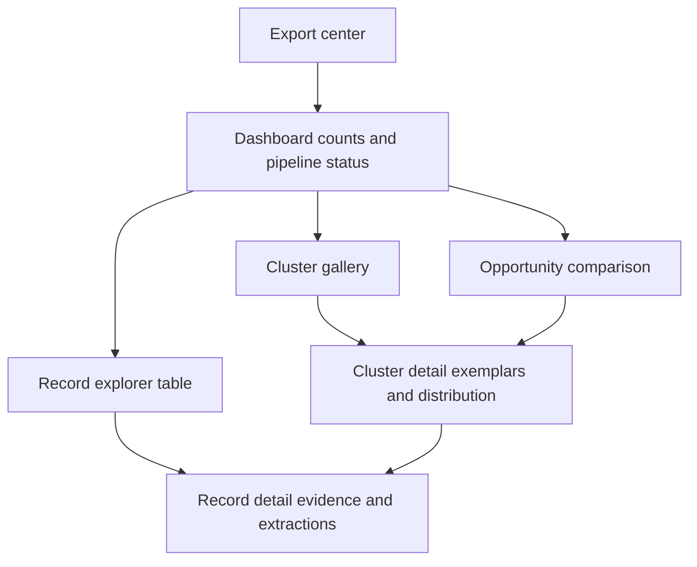

**Filter dimensions (from requirements):** retrieval problem cluster, memory type (derived tag), source, relevance, outcome, date range.

---

## 10. Deployment reference architecture

Suitable for a single-operator research project with local or small-cloud deployment.

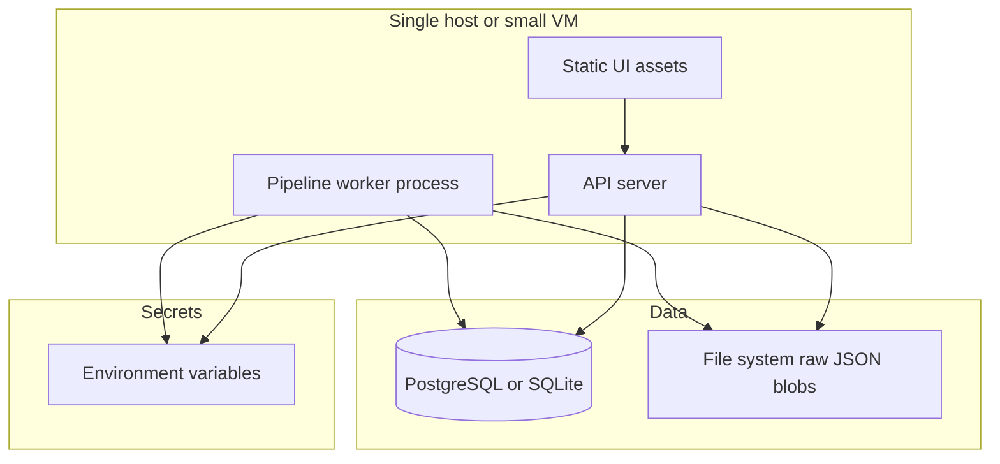

| Component | Suggested default | Notes |
|-----------|-------------------|--------|
| Database | PostgreSQL (prod) / SQLite (local) | Relational fits filters and exports |
| Raw store | Filesystem or object storage | Large JSON from Apify/YouTube |
| Worker | Python asyncio or task queue | Same codebase as CLI |
| API | FastAPI or similar | OpenAPI for UI codegen |
| UI | React/Next or simple Vite SPA | Table-heavy explorer |

Scaling beyond ~10k records is not a primary requirement; **batch efficiency and provenance** matter more than horizontal scale.

---

## 11. Security, privacy, and compliance

- **Secrets:** YouTube and LLM keys only in environment or secret manager; never committed.
- **Data:** Public conversations only; document retention policy for exports.
- **PII:** Do not enrich records with private data; optional redaction of usernames in exports if interviews use anonymized quotes.
- **LLM:** Send minimum necessary text; truncation documented in provenance.

---

## 12. Observability

| Signal | Use |
|--------|-----|
| Per-stage record counts | Dashboard + pipeline health |
| LLM tokens / call count | Budget tracking |
| Relevance rate | Calibrate filters |
| Failed validations | Prompt/schema fixes |
| Export audit log | Who exported what snapshot |

---

## 13. Testing strategy

| Level | Focus |
|-------|--------|
| **Unit** | Normalizers, dedup keys, deterministic filter, schema validation |
| **Contract** | Golden files per ingestor → canonical JSON |
| **Integration** | Mock LLM gateway; end-to-mini-pipeline on fixture dataset |
| **Evaluation** | Gold set vs [`docs/relevance-criteria.md`](./docs/relevance-criteria.md); relevance/extraction regression; no Reddit-only prompt fixtures as sole eval |

---

## 14. Implementation phasing

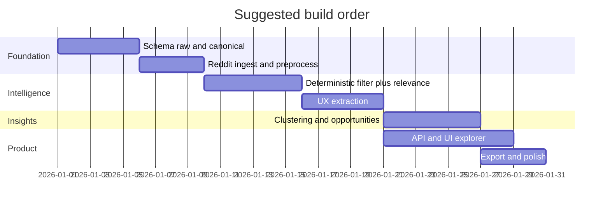

Phases can overlap (e.g. UI on mock data while pipeline matures). YouTube and store ingestors plug in parallel once the ingestor contract exists.

---

## 15. Traceability chain (insight to evidence)

Every user-visible insight must resolve this chain:

```
Opportunity rank
  → Cluster ID
    → Member record IDs
      → UX extraction (versioned)
        → Relevance rationale (versioned)
          → Canonical record
            → Raw payload + permalink
```

The UI **Record detail** view is the leaf anchor; cluster and opportunity screens always surface exemplar links and counts.

---

## 16. Document lineage

| Document | Role |
|----------|------|
| [`problemStatement.txt`](./problemStatement.txt) | Original requirements |
| [`context.md`](./context.md) | Condensed product and research context |
| **`architecture.md`** | Technical structure, components, data model, diagrams |
| [`implementation-plan.md`](./implementation-plan.md) | Phases 2–3 source-agnostic relevance and extraction |

---

## 17. Open architecture decisions

Record choices during implementation:

1. **Embedding model** for clustering — local vs API.
2. **Cluster count** — fully unsupervised vs researcher-adjustable k.
3. **Auth** — open local tool vs login for shared deployment.
4. **Groq fallback** — automatic on Gemini rate limit vs manual switch.

These do not block the core architecture above; they affect configuration and ops only.
