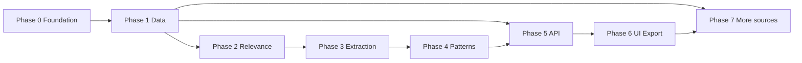
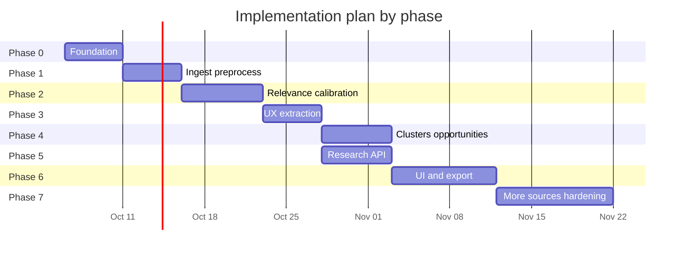

# Phase-Wise Implementation Plan

This plan translates `[context.md](./context.md)` and `[architecture.md](./architecture.md)` into buildable phases with deliverables, acceptance criteria, and dependencies. It is optimized for **evidence-first discovery**, **low LLM cost**, and a **researcher-facing** outcome that answers the north star question.

---

## Executive summary

| Phase | Name                           | Primary outcome                                                  | Depends on                        |
| ----- | ------------------------------ | ---------------------------------------------------------------- | --------------------------------- |
| **0** | Project foundation             | Runnable repo, schema, config, secrets pattern                   | —                                 |
| **1** | Data foundation                | Reddit ingested, normalized, deduped; raw ≠ processed            | Phase 0                           |
| **2** | Relevance pipeline             | Source-agnostic relevance (calibrated on Reddit); resumable batches | Phase 1                           |
| **3** | UX extraction                  | Same experiential schema on all relevant records; no problem taxonomy | Phase 2                           |
| **4** | Pattern & opportunity          | Clusters/archetypes + ranked opportunity areas with traceability | Phase 3                           |
| **5** | Research API                   | Read APIs for records, clusters, opportunities, stats            | Phase 1 (mock), Phase 4 (full)    |
| **6** | Research UI & export           | Explorer, filters, drill-down, CSV/JSON/report export            | Phase 5                           |
| **7** | Additional sources & hardening | YouTube, app stores, eval set, ops polish                        | Phases 1–6 (parallel where noted) |

**Suggested calendar (single developer, ~6–8 weeks):** Phases 0–4 sequential (~4 weeks), Phase 5 overlaps late Phase 3 (~1 week), Phase 6 (~1.5 weeks), Phase 7 ongoing (~1–2 weeks).

**Primary actor (per** `[architecture.md](./architecture.md)`**):** **Researcher / Operator** — one person for this MVP: ingest datasets, configure API keys, run and monitor the pipeline, and explore/export findings in the research UI.

### Implementation status (as of 2026-10-04)

| Phase | Engineering status | Notes |
| ----- | ------------------ | ----- |
| **0** | **Done** | Migrations `001`–`005`, `discover` CLI, config, metrics, tests |
| **1** | **Done** | Reddit Apify ingest + preprocess; multi-file ingest supported |
| **2** | **Done** | Gate + LLM relevance (`relevance_v2`), dynamic batching, Groq/mock, `--bypass-gate`, `relevance-report` |
| **3** | **Done** | `extraction_v1`, checkpoints, `--research-set`, `extract-report`, `extract-qa-sample` |
| **4** | **Done** | TF-IDF + k-means, opportunity scoring, publish snapshot + markdown; optional Gemini cluster labels |
| **5** | **Done** | FastAPI app (`discover serve`), stats, records, clusters, opps, export endpoints & integration tests |
| **6** | **Done** | Research Web UI (`ui/`), Dashboard, Opportunities, Clusters, Record Explorer, Modal & Export Center |
| **7** | **Done** | YouTube & Store review ingestors (`youtube`, `google_play`, `app_store`), FallbackProvider, TokenTelemetry, gold set eval & `EVALUATION.md` |

**Calibration corpus (Reddit):** ~2,088 canonical Reddit rows after additional ingest; relevance run `d2c78beb-e832-4b0a-b930-0212aeb81481` (`relevance_v2`, bypass-gate calibration) → **190** classifier-relevant records (metrics report excludes fixture sample `sample01`).

**Validated Research Themes (190-record corpus):** Derived from `data/processed/theme_validation.json` and `extraction_report_full_relevant.json`:
- **T1 Search & AI retrieval regression** (29 primary records / 10 threads) — Adjacent
- **T2 Imprecise visual memory → retrieval gap** (17 primary records / 12 threads) — **Core MVP Opportunity**
- **T3 Missing, stacked, or unsynced media** (11 primary records / 5 threads) — Out of scope initial
- **T4 Query expressiveness & metadata access** (19 primary records / 10 threads) — Adjacent
- **T5 Ephemeral GP memories & collage→original** (4 primary records / 3 threads) — Core adjacent

**Research slice (exploratory clustering):** `data/processed/high_confidence_research_set.json` — **56** curated `record_id`s retained as 9 exploratory machine-generated clusters (`8b5a2333-…`) alongside the 5 human-validated research themes.

**Key artifacts:** `data/processed/theme_validation.json`, `data/processed/theme_validation.md`, `data/processed/relevance_report_v2_bypass_gate.json`, `data/processed/extraction_report_full_relevant.json`, `data/processed/opportunity_summary_8b5a2333.md`, `data/processed/published_snapshot_8b5a2333.json`.

**ADR:** [`docs/adr/001-stack.md`](docs/adr/001-stack.md), [`docs/adr/002-clustering-embeddings.md`](docs/adr/002-clustering-embeddings.md).

---

## Cross-cutting requirements (every phase)

These constraints from `context.md` apply throughout:

- Do **not** assume a final problem taxonomy or build a Google Photos search product.
- Do **not** invent fields not supported by source text; use nullable structured outputs.
- Keep **raw payloads immutable**; version LLM outputs by `analysis_run_id` + `model_id`.
- Make pipeline stages **idempotent** and **resumable** after each batch checkpoint.
- Preserve **traceability**: opportunity → cluster → record → raw + permalink.
- **Relevance and extraction (Phases 2–3)** use **source-agnostic** rules and prompts on `canonical_record` only; per-source adapters stop at Phase 1. Reddit is for **calibration and validation**, not for special-case logic.

---

## Phase 0 — Project foundation

**Goal:** Establish repository structure, persistence skeleton, configuration, and CLI entry point so later phases plug in without rework.

### Scope

| Work item                      | Description                                                                                                                            |
| ------------------------------ | -------------------------------------------------------------------------------------------------------------------------------------- |
| Repo layout                    | `src/` pipeline, `ingestors/`, `api/`, `ui/` (or monorepo packages); `data/raw/`, `data/processed/` gitignored                         |
| Stack decision (record in ADR) | Python **3.9+** CLI (`pyproject.toml`); SQLite default; FastAPI + Vite/React planned Phase 5–6 — see [ADR 001](docs/adr/001-stack.md) |
| Database migrations            | Tables per architecture §6: `ingest_run`, `raw_record`, `canonical_record`, `pipeline_run`, `job_checkpoint` (analysis tables stubbed) |
| Config                         | `.env.example` for `GEMINI_API_KEY`, `GROQ_API_KEY` (optional), `YOUTUBE_API_KEY`, `DATABASE_URL`                                      |
| Orchestrator shell             | `discover` CLI: `migrate`, `ingest`, `run`, `publish`, `relevance-report`, `extract-report`, `extract-qa-sample`, `opportunity-report` |
| Logging & metrics hooks        | Structured logs; counters for records processed per stage                                                                              |
| Dev docs                       | `README.md` quickstart: install, migrate, run empty pipeline                                                                           |

### Deliverables

- [x] Migrations apply cleanly on fresh DB (`001`–`005`)
- [x] `discover migrate` succeeds
- [x] `discover run --stage preprocess --dry-run` exits 0 with no data

### Acceptance criteria

- New developer can clone, install deps, run migrations in <15 minutes.
- No secrets in git; `.env.example` documents all keys.

### Risks & mitigations

| Risk                   | Mitigation                                                   |
| ---------------------- | ------------------------------------------------------------ |
| Over-engineering stack | Default SQLite + single process; defer Postgres until needed |

**Estimated effort:** 3–5 days

---

## Phase 1 — Data foundation (ingestion & preprocessing)

**Goal:** Load Reddit Apify JSON, normalize to canonical schema, dedupe and noise-filter, with full provenance.

### Scope

| Work item                 | Description                                                                                                   |
| ------------------------- | ------------------------------------------------------------------------------------------------------------- |
| `SourceIngestor` contract | `discover()`, `fetch()`, store raw JSON + `ingest_run` manifest (checksum, counts)                            |
| Reddit Apify adapter      | Map Apify fields → `raw_record`; preserve permalink, author, body, timestamps, scores                         |
| Raw store                 | Write verbatim payload (DB JSON column or filesystem blob + pointer)                                          |
| Normalizer                | `canonical_record`: `source_type`, `title`, `body`, `author_handle`, `posted_at`, `permalink`, `content_hash` |
| Deduplication             | `(source_type, content_hash)` + optional fuzzy near-dup log in `duplicate_groups`                             |
| Noise rules               | Drop empty/spam; log `excluded_noise` with reason (conservative)                                              |
| Preprocess stage          | CLI: `discover ingest --source reddit --file <path>` then `discover run --stage preprocess`                   |
| Contract tests            | Golden fixture: sample Apify JSON → expected canonical JSON                                                   |

### Deliverables

- [x] ≥900 canonical records from initial ~1k Reddit file (variance documented if lower due to dedup/noise)
- [x] Every canonical row links to `raw_record_id` and `ingest_run_id`
- [x] Stage report: ingested / normalized / deduped / excluded counts (preprocess metrics + audit tables migration `002`)
- [x] Additional Reddit ingest supported (e.g. targeted scraper JSON → new `ingest_run` + canonical rows)

### Acceptance criteria

- 100% of canonical records have non-empty `body` or combined title+body.
- Permalinks resolvable for manual spot-check (sample 10 records).
- Re-running preprocess is idempotent (no duplicate canonical rows).

### Dependencies

- Phase 0 complete; Reddit dataset file available locally (uploaded by Researcher / Operator).

### Parallel track (optional, same phase)

- **Generic CSV/JSON importer** for Play/App store fallback files (schema mapping config only; full adapters in Phase 7).

**Estimated effort:** 4–5 days

---

## Phase 2 — Relevance identification

**Goal:** Hybrid deterministic + Gemini batch classification with **source-independent** criteria tied to the overall research objective ([`context.md`](./context.md) north star and discovery themes)—not to Reddit wording, subreddit context, or a predetermined problem taxonomy.

A record is in scope when it offers **evidence about vaguely remembered visual content** (photos, videos, screenshots, documents) and **difficulty retrieving it in Google Photos** (or direct comparison while attempting GP retrieval). Criteria are expressed in terms of **canonical fields** (`title`, `body`, `source_type` as metadata only) so the **same pipeline** runs unchanged after Phase 7 on normalized YouTube, Google Play, and App Store records.

**Calibration (Reddit only):** Use the current Reddit corpus (~956 canonical rows) to tune thresholds and prompts and to hit the volume target below. Reddit does **not** define special rules—only provides the first gold set and precision/recall checks.

**Volume target (current corpus):** **150–200+** relevant records from the Reddit file after dedup/noise (adjust if the corpus cannot support; document in the calibration report).

### Scope

| Work item | Description |
| --------- | ----------- |
| **`docs/relevance-criteria.md`** | Written criteria aligned to research themes (memory gaps, recall vs forgotten, search formulation, failure points, workarounds)—explicitly **not** cluster names, MVP hypotheses, or Reddit-specific patterns |
| Deterministic gate | Lightweight pass on **canonical text only**: Google Photos / visual-library retrieval intent; exclude obvious off-topic (billing, unrelated apps, generic praise with no retrieval story). **No** subreddit lists, Reddit idioms, or comment-thread heuristics as primary signals |
| Prompt v1 + JSON schema | `is_relevant`, `confidence`, `rationale`, `retrieval_signal_types[]` where signal types map to **objective themes** (open labels), not problem archetypes |
| LLM gateway | Gemini/Groq/mock; **dynamic batch packing** (`pack_relevance_batches`) by record count + `RELEVANCE_MAX_BATCH_INPUT_TOKENS`; split-on-failure; RPM/TPM sliding window |
| `relevance_result` table | Upsert on `(record_id, analysis_run_id)`; store `model_id`, prompt version; gate skip + analysis status fields (migration `003`) |
| Checkpoints | Per-batch persistence; `--resume` skips rows already in `relevance_result` |
| Budget guard | `RELEVANCE_MAX_LLM_CALLS`, `--limit`, `--resume`; env batch size / delay / Gemini limits in `.env.example` |
| Prompt versions | **`relevance_v2`** (stricter GP + retrieval/memory criteria); v1 retained in history via `analysis_run_id` |
| Calibration | `--bypass-gate` for full-corpus LLM calibration (minimal prefilter only); `discover relevance-report`; fixture exclusions in report export where configured |
| Groq (optional) | `--llm-provider groq` |

### Design constraints (non-negotiable)

- **No source-specific branches** in relevance code (e.g. `if source_type == "reddit"` for labeling logic). Ingest/normalize differences stay in Phase 1 / Phase 7 adapters only.
- **No hard-coded problem taxonomy** (no enums like “screenshot_search_failure” tied to eventual clusters). Clustering is Phase 4; relevance only answers “in scope for fuzzy visual retrieval research?”
- **Balanced relevance** per `context.md`: neither unrelated GP complaints nor narrow loss of on-topic retrieval stories.

### Deliverables

- [x] `docs/relevance-criteria.md` (source-agnostic definition + examples phrased generically)
- [x] `discover run --stage relevance --resume` completes full candidate set on Reddit canonical data
- [x] Calibration report export (`discover relevance-report --analysis-run-id …`) — counts, gate skip, relevant / not relevant
- [x] Checklist: prompts and gate rules contain **no Reddit-only** mandatory keywords as the sole decision path (code review + criteria doc)
- [ ] Formal gold-set precision/recall ≥0.8 on ~30 labeled records (manual labeling backlog; not automated in repo)

### Acceptance criteria

- **≥150 relevant** on the Reddit corpus **or** documented ceiling with Researcher / Operator sign-off (volume is a **calibration outcome**, not the definition of relevance). **Current:** v2 bypass-gate run on combined corpus → **190** relevant (see status table); HC research set **56** records for deep-dive extract/cluster work.
- Gold-set precision meets agreed threshold (e.g. ≥0.8 on labeled relevant); borderline cases documented in report.
- Unrelated complaint spam does not dominate relevant set (manual review of random 20 relevant + 20 borderline).
- Failed JSON parses &lt;2% with `analysis_failed` status and error text.
- Second run with same `analysis_run_id` does not duplicate LLM calls (idempotency).
- **Portability:** engineering review confirms relevance stage inputs are only `canonical_record` (+ optional `source_type` in prompt context) so Phase 7 sources require **no relevance code changes**—only re-run on new IDs.

### Dependencies

- Phase 1 canonical records; `GEMINI_API_KEY` available.

### Risks & mitigations

| Risk | Mitigation |
| ---- | ---------- |
| Too few relevant (Reddit) | Tune against criteria doc; add sources in Phase 7 (same relevance stage) |
| Too many irrelevant | Tighten objective-aligned gate; raise confidence threshold |
| Reddit-shaped prompts | Review `relevance-criteria.md` + gold set; remove platform-specific few-shot examples |
| API quota | Smaller batches, cache hashes, optional Groq |

**Estimated effort:** 5–7 days (includes calibration iteration)

---

## Phase 3 — User experience extraction

**Goal:** For every `is_relevant=true` record—**any source**—extract structured **experience** fields **only when evidenced** in text. Extraction follows the same research objective as Phase 2 but does **not** assign problem archetypes, cluster IDs, or opportunity labels (those emerge in Phase 4).

### Scope

| Work item | Description |
| --------- | ----------- |
| Extraction schema | `retrieval_scenario`, `remembers`, `forgotten`, `search_attempt`, `failure_point`, `workaround`, `outcome` (all nullable)—**experiential**, not a problem taxonomy |
| Evidence spans | Optional quotes/offsets per field for UI highlight |
| Batch extraction prompt | Single **source-agnostic** prompt; `source_type` / permalink allowed as context only. Emphasize: do not invent; use `null` if absent |
| `ux_extraction` table | Versioned by `analysis_run_id` |
| Integration with gateway | Reuse batching, checkpoints, validation from Phase 2 |
| QA sampling | `discover extract-qa-sample` — random sample (stratify by `source_type` when multi-source exists); [`docs/extraction-criteria.md`](docs/extraction-criteria.md) |
| Research-set scope | `--research-set path.json` limits extract to listed `record_id`s (e.g. high-confidence set) without changing relevance labels |
| **Out of scope** | Fields such as `problem_archetype`, `cluster_id`, `opportunity_rank`, or fixed category enums—**forbidden in Phase 3** |

### Relationship to Phase 2

- Phase 3 runs **only** on records Phase 2 marked relevant using **source-independent** criteria.
- When YouTube / Play / App Store data arrive (Phase 7), run **the same** `discover run --stage extract` with no prompt fork per platform.

### Deliverables

- [x] Extraction pipeline + schema (`extraction_v1`); `ux_extraction` status fields (migration `004`)
- [x] `discover extract-report` / `extract-qa-sample`; full extract on all relevant rows **or** `--research-set` subset (56/190 extracted for HC run by operator choice)
- [ ] QA checklist formally signed off (spot-checks possible via `extract-qa-sample` output)

### Acceptance criteria

- ≥70% of relevant records have at least **3** non-null structured fields (benchmark, not hard fail if data is thin).
- Zero tolerance for fabricated URLs, dates, or search queries not present in source (spot-check QA).
- Pipeline resumable after interruption without re-processing completed records.
- Extraction JSON schema contains **no** predetermined problem-type enum tied to MVP or clusters.

### Dependencies

- Phase 2 relevance labels (source-agnostic pipeline, calibrated on Reddit).

**Estimated effort:** 4–5 days

---

## Phase 4 — Pattern discovery & opportunity analysis

**Goal:** Emergent **retrieval problem archetypes** (clusters) and **ranked opportunity areas** with evidence metrics—no predefined taxonomy.

### Scope

| Work item                       | Description                                                                                             |
| ------------------------------- | ------------------------------------------------------------------------------------------------------- |
| Feature construction            | `build_clustering_document()` — structured fields + title + truncated body ([ADR 002](docs/adr/002-clustering-embeddings.md)) |
| Clustering                      | **TF-IDF** (1–2 grams) + **k-means**; k chosen by silhouette (override `--num-clusters`); `cluster`, `cluster_member`, exemplars in `metadata_json` |
| Cluster labeling (optional LLM) | During `cluster` stage (`label_clusters` default) or **in-place** relabel: `scripts/label_clusters_in_place.py` (no membership change) |
| Opportunity metrics             | Rule-based frequency, severity, consistency (source mix), evidence strength → `opportunity_score` |
| `publish` snapshot              | `published_snapshot.snapshot_json` + files under `data/processed/` |
| Narrative export                | `opportunity_summary_<cluster_run>.md`; `discover publish --top-opportunities N` |
| CLI                             | `discover run --stage cluster\|opportunity\|publish`; `--analysis-run-id`, `--cluster-analysis-run-id`, `--research-set`, `--no-cluster-labels`; `discover opportunity-report` |
| Dependencies                    | `numpy`, `scikit-learn` (see `pyproject.toml`) |

### Deliverables

- [x] Cluster + opportunity + publish stages wired in `discover run` / `discover publish`
- [x] HC 56-record run: **9** clusters, **56/56** members assigned; top **5** opportunities published (`8b5a2333-…`)
- [x] Traceability: exemplar + representative `record_id`s in cluster `metadata_json` and publish JSON/markdown
- [ ] Full-corpus cluster (all **190** relevant extractions) — optional; HC subset used for first validated pipeline pass
- [ ] Clusters cover ≥90% of **all** relevant records when clustering full extraction set (noise cluster explicit if needed)

### Acceptance criteria

- Researcher can answer north star question **using only system outputs + drill-down to sources** (walkthrough demo).
- Cluster labels are descriptive, not solution prescriptions (“can’t find screenshot from years ago” vs “build visual search”).
- Re-run clustering creates new `analysis_run_id` without deleting history.

### Dependencies

- Phase 3 structured extractions.

### Open decisions (resolve in this phase)

1. **Resolved:** TF-IDF + k-means (no API embeddings) — see [ADR 002](docs/adr/002-clustering-embeddings.md).
2. Researcher-adjustable cluster count: CLI `--num-clusters` today; UI slider deferred to Phase 6.
3. **Research tooling:** `scripts/build_high_confidence_research_set.py` builds curated ID list from relevance positives + heuristics (does not alter classifier output).

**Estimated effort:** 5–6 days

---

## Phase 5 — Research API

**Goal:** Read-only HTTP API for stats, records, clusters, opportunities, and export triggers.

### Scope

| Work item                     | Description                                                                                                                                  |
| ----------------------------- | -------------------------------------------------------------------------------------------------------------------------------------------- |
| FastAPI (or chosen framework) | OpenAPI spec                                                                                                                                 |
| Endpoints                     | `/stats/sources`, `/stats/pipeline`, `/records`, `/records/{id}`, `/clusters`, `/clusters/{id}/members`, `/opportunities`, `/export/dataset` |
| Filtering                     | `source_type`, `is_relevant`, `cluster_id`, date range, text search on body                                                                  |
| Pagination                    | Cursor or offset; stable sort                                                                                                                |
| Published snapshot            | Reads from `publish` output of Phase 4                                                                                                       |
| CORS                          | Enable for local UI dev                                                                                                                      |
| Mock mode (early)             | Serve fixture JSON before Phase 4 completes (optional parallel start after Phase 1)                                                          |

### Deliverables

- [x] OpenAPI JSON committed or generated (`/openapi.json` & `/docs`)
- [x] Integration tests for main list/detail endpoints (`tests/test_phase5.py`)
- [x] Export endpoint returns CSV + JSON bundle with lineage fields

### Acceptance criteria

- Record detail returns: canonical fields, raw payload reference, relevance, extraction, cluster memberships.
- List endpoints respond <500ms on ~2k records (local SQLite benchmark).
- Every cluster/opportunity response includes member counts and exemplar IDs.

### Dependencies

- Phase 1 for early mock; **Phase 4 publish** for production data.

**Estimated effort:** 4–6 days (can overlap last days of Phase 3–4)

---

## Phase 6 — Research UI & export

**Goal:** Researcher-facing interface per `context.md`: explore, filter, inspect evidence, compare opportunities, export.

### Scope

| Work item       | Description                                                                           |
| --------------- | ------------------------------------------------------------------------------------- |
| Dashboard       | Source counts, relevant count, pipeline run status                                    |
| Record explorer | Table with filters (source, cluster, memory tags derived from extraction)             |
| Record detail   | Original text, permalink, structured fields, evidence highlights, relevance rationale |
| Clusters        | Gallery/list → cluster detail with distribution + exemplars                           |
| Opportunities   | Comparison view (frequency, severity, consistency, evidence)                          |
| Export center   | Download analyzed dataset + findings summary                                          |
| UX polish       | Empty states, loading, error from API                                                 |

### Deliverables

- [x] All required researcher capabilities from `context.md` § “Required Application” (Dashboard, Opportunities, Clusters, Record Explorer, Modal, Export)
- [x] End-to-end demo script (5-minute researcher walkthrough documented in README/UI)

### Acceptance criteria

- Click from opportunity → cluster → record → external permalink works.
- Filters combine correctly (e.g. Reddit + cluster X).
- Export matches API `/export/dataset` schema and includes `record_id` on every row.

### Dependencies

- Phase 5 API (published snapshot).

**Estimated effort:** 7–10 days

---

## Phase 7 — Additional sources, evaluation & hardening

**Goal:** Expand evidence base across sources; improve confidence in relevance/extraction; operational readiness.

### Scope

| Work item                | Description                                                                |
| ------------------------ | -------------------------------------------------------------------------- |
| YouTube ingestor         | Search + metadata + comments; quota-aware caching in raw store             |
| Play / App Store         | API or imported datasets via generic importer                              |
| Merge into pipeline      | Re-run preprocess → **same** relevance + extract stages (incremental on new `canonical_record` IDs only; no per-source prompt forks) |
| Cross-source consistency | Opportunity metrics use multi-source signals                               |
| Evaluation set expansion | Grow gold labels to ~50; regression test on relevance prompt changes       |
| Groq fallback            | Auto or manual failover documented                                         |
| Observability            | Token/call dashboard; per-stage counts in UI or CLI report                 |
| Auth (optional)          | If shared deployment: basic auth or SSO—skip for local-only                |

### Deliverables

- [x] At least one non-Reddit source ingested and represented in canonical DB (`youtube`, `google_play`, `app_store`)
- [x] Updated opportunity ranking with cross-source notes
- [x] [`EVALUATION.md`](./EVALUATION.md) with metrics, labeling guidelines, precision/recall benchmarks, and evaluation runner (`scripts/run_eval.py`)

### Acceptance criteria

- Combined corpus still meets or exceeds **150–200 relevant** records where data allows.
- No regression on Reddit gold-set precision below agreed threshold (e.g. 0.8 precision on gold relevant).

### Dependencies

- Phases 1–6; YouTube API key and store review datasets configured by Researcher / Operator.

**Estimated effort:** 5–10 days (variable by source availability)

---

## Milestone map vs north star

| Milestone                     | Phases | Research value                               |
| ----------------------------- | ------ | -------------------------------------------- |
| **M1 — Data trust**           | 0–1    | Can audit any insight back to Reddit source  |
| **M2 — Relevant corpus**      | 2      | Curated set of real retrieval struggles      |
| **M3 — Structured evidence**  | 3      | Thematic coding without manual spreadsheet   |
| **M4 — Problem hypotheses**   | 4      | Ranked opportunities for interviews          |
| **M5 — Research workstation** | 5–6    | Team explores and exports for 5–6 interviews |
| **M6 — Richer evidence**      | 7      | Multi-source validation of patterns          |

---

## Testing & quality gates

| Gate   | When        | Criteria                                      |
| ------ | ----------- | --------------------------------------------- |
| **G0** | End Phase 1 | Contract tests pass; ingest report            |
| **G1** | End Phase 2 | Gold-set metrics + relevant count target      |
| **G2** | End Phase 3 | QA sample: no fabrication                     |
| **G3** | End Phase 4 | Walkthrough answers north star with citations — **HC pipeline + synthesis complete; formal demo script TBD** |
| **G4** | End Phase 6 | Researcher checklist signed off               |
| **G5** | End Phase 7 | Multi-source + eval regression                |

Suggested test layers from `architecture.md` §13: unit (normalizers, filter), contract (ingestors), integration (mock LLM), evaluation (gold set).

---

## LLM usage budget (planning)

Rough order-of-magnitude for Reddit ~1k → ~400–600 post-filter candidates:

| Stage          | Calls (indicative) | Notes                                   |
| -------------- | ------------------ | --------------------------------------- |
| Relevance      | ~75–240 API calls / ~900 records (typical) | Dynamic packing; default batch cap 12; gate or `--bypass-gate` changes volume |
| Extraction     | ~15–40 batches     | Per relevant count; HC subset = 56 records |
| Cluster labels | 1 call per cluster | Optional (`--no-cluster-labels`); in-place relabel script for existing runs |

**Total:** prioritize objective-aligned deterministic gate quality in Phase 2 to minimize spend. Token estimates apply per **canonical corpus**, not Reddit alone.

---

## Phase timeline (Gantt)

Adjust dates to your start day; Phase 5 intentionally starts after Phase 3 so API development can use relevance/extraction data while clustering finishes.

---

## Suggested backlog order (first two weeks)

**Week 1**

1. Phase 0: migrations, CLI, config
2. Phase 1: Reddit ingest + normalize + dedup + reports
3. Start gold-set labeling (30 records) in parallel

**Week 2**

1. Phase 2: deterministic gate + LLM relevance + calibration
2. Phase 3: extraction schema + first full run on relevant set
3. Spike Phase 5: `/records` list/detail against real DB

---

## Document lineage

| Document                               | Role                                                |
| -------------------------------------- | --------------------------------------------------- |
| `[context.md](./context.md)`           | Product scope, constraints, researcher requirements |
| `[architecture.md](./architecture.md)` | Components, data model, diagrams                    |
| `implementation-plan.md`               | Phases, tasks, acceptance criteria, timeline, **implementation status** |
| `docs/extraction-criteria.md`          | Phase 3 QA grounding rules                          |
| `docs/adr/002-clustering-embeddings.md` | Phase 4 clustering decision (TF-IDF + k-means)   |

---

## Checklist: ready for user interviews

Before scheduling 5–6 interviews, confirm:

- [x] ≥150 relevant records on Reddit corpus (**190** v2 bypass-gate); extractions on full set or documented subset (**56** HC + **134** not yet extracted unless batch run)
- [x] Top 3–5 opportunity areas reviewed and validated (Researcher / Operator) — 5 validated research themes derived from 190-record corpus (`T1_search_ai_regression`, `T2_fuzzy_visual_memory`, `T3_library_integrity`, `T4_query_metadata_power`, `T5_ephemeral_memories`) with `T2` confirmed as Core MVP Opportunity.
- [x] Export bundle paths: `published_snapshot_8b5a2333.json`, `opportunity_summary_8b5a2333.md`, relevance/extraction reports
- [ ] Each interview talking point links to ≥3 source permalinks (manual prep)
- [ ] Known limitations documented (sources, bias, LLM errors, low silhouette on small-N cluster)

This completes the implementation path from raw public conversations to an **evidence base** for problem definition and AI-native MVP selection.